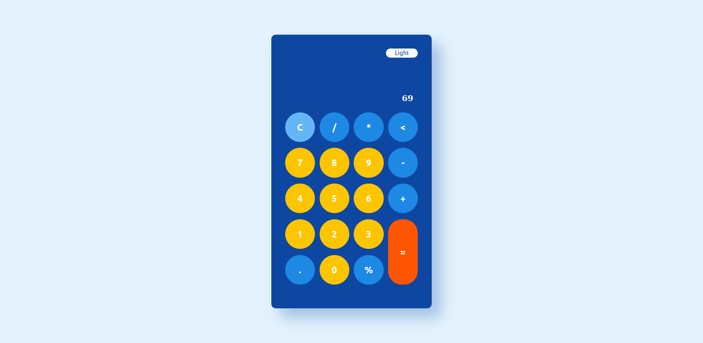

<h1 align = "center"> Simple Calculator with TypeScript </h1>


 


## Run Project

```bash
$ npm i 
$ npm run dev
```

### Simple DOM manipulation with TypeScript
```ts
const btn = document.querySelector(".btn") as HTMLButtonElement | null;
const containerResult = document.querySelector(
    ".result"
) as HTMLSpanElement | null;
```